# Skymly · 落笔wys

---

### About · 关于

I'm **Skymly** ([落笔wys](https://github.com/Skymly)) — **C# / .NET** libraries where **compile-time codegen** and **small runtime primitives** do the heavy lifting. Also active in **[MvvmAIO](https://github.com/MvvmAIO)** on MVVM generators.

写靠**编译期代码生成**与**精简运行时原语**驱动的 **C# / .NET** 库；也会在 **[MvvmAIO](https://github.com/MvvmAIO)** 协作 MVVM 生成器。

---

## Featured · 主推

  
  

### [Observables](https://github.com/Skymly/Observables)

Ten-domain reactive Roslyn generators (events, HTTP, SignalR, MQTT, WebSocket, gRPC, SSE, NATS, Postgres, Redis) → **R3** / **System.Reactive**. Stable **0.2.0**, ~20 NuGet packages.

→ [Docs](https://skymly.github.io/Observables.Docs/) · [Samples](https://github.com/Skymly/Observables.Samples) · [NuGet](https://www.nuget.org/profiles/Skym)

### [DesignPatterns](https://github.com/Skymly/DesignPatterns)

Pattern primitives + source generators, analyzers (`DP###`), and code fixes. Early preview — pin a version.

→ [Docs](https://skymly.github.io/DesignPatterns.Docs/) · [NuGet](https://www.nuget.org/packages/Skymly.DesignPatterns)

### [GitPulse](https://github.com/Skymly/GitPulse)

Cross-platform **.NET MAUI** GitHub client — living **[Observables](https://github.com/Skymly/Observables)** showcase (not a production client).

→ [Repository](https://github.com/Skymly/GitPulse)

### [dotnet-mcp](https://github.com/Skymly/dotnet-mcp)

**.NET MCP** server — C# / VB / F# symbols, XAML, source-generator attribution, restricted workspace edit. `dnx dotnet-mcp` · **3.0 / 4.0** shipped.

→ [Repository](https://github.com/Skymly/dotnet-mcp) · `dnx dotnet-mcp --yes`

---

## Now · 当前

Shipping Roslyn generators and building a private desktop coding agent; GitPulse is the Observables showcase.

在做 Roslyn 生成器与私有桌面编程助手；GitPulse 是 Observables 活样板。

## Stats · 概览

 

---

## Contact · 交流

Issues and focused PRs welcome in each repo. Also active in **[MvvmAIO](https://github.com/MvvmAIO)**.

