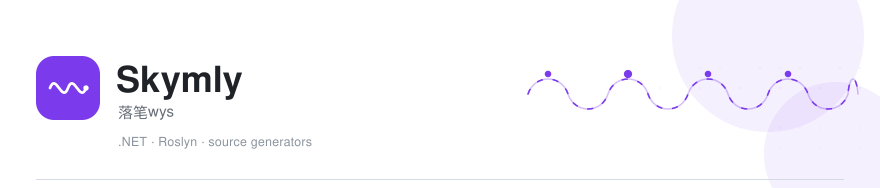
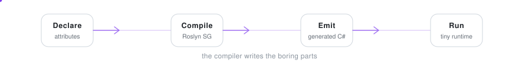
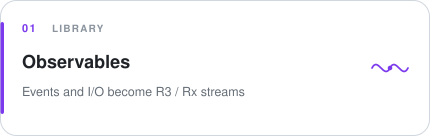
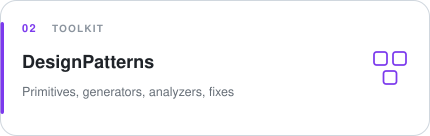
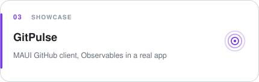
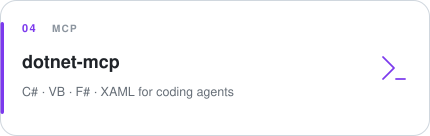

### About · 关于

- Compile-time **C# / .NET** libraries — attributes become working APIs, the runtime stays small.
- Flagship: **[Observables](https://github.com/Skymly/Observables)** turns events and I/O into **R3** / **System.Reactive** streams.
- Also **[MvvmAIO](https://github.com/MvvmAIO)** on MVVM generators.

## Featured · 主推

<table>
  <tr>
    <td width="50%">
      
    </td>
    <td width="50%">
      
    </td>
  </tr>
  <tr>
    <td>
      
    </td>
    <td>
      
    </td>
  </tr>
</table>

  <a href="https://skymly.github.io/Observables.Docs/">Observables docs</a>
  ·
  <a href="https://github.com/Skymly/Observables.Samples">samples</a>
  ·
  <a href="https://www.nuget.org/profiles/Skym">NuGet</a>
  ·
  <a href="https://skymly.github.io/DesignPatterns.Docs/">DesignPatterns docs</a>
  ·
  <code>dnx dotnet-mcp --yes</code>

## Now · 当前

Shipping Roslyn generators and building a private desktop coding agent; GitPulse is the Observables showcase.

在做 Roslyn 生成器与私有桌面编程助手；GitPulse 是 Observables 活样板。

## Stats · 概览

  
  

## Contact · 交流

Issues and focused PRs welcome in each repo. Also active in **[MvvmAIO](https://github.com/MvvmAIO)**.

